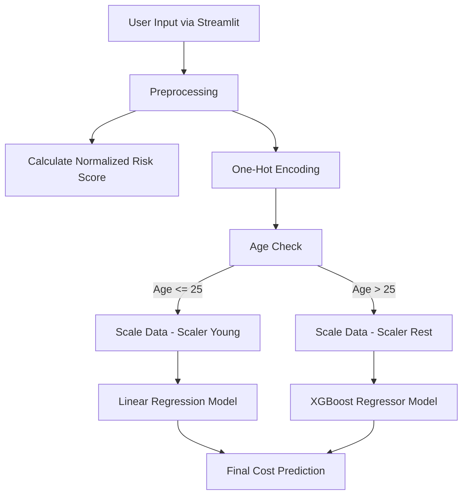

# Smart-Health-Insurance-Cost-Predictor

# Smart Health Insurance Cost Predictor

A robust Machine Learning web application designed to predict health insurance premiums based on user demographics, health history, and policy preferences.

## 🧠 Project Overview

The **Smart Health Insurance Cost Predictor** solves the challenge of non-linear pricing in insurance. Insurance costs often behave differently for young adults compared to older demographics due to varying risk factors.

To address this, the project employs a **Hybrid Model Strategy**:

- **Young Demographic (≤ 25 years):** Uses Linear Regression (Scikit-Learn), as costs tend to scale more linearly within this age group.
- **Rest Demographic (> 25 years):** Uses XGBoost Regressor, which can capture complex, non-linear relationships and interactions between age, BMI, and medical history.

## ⚙️ How It Works

The application processes user inputs, calculates a custom risk score, and routes the data to the appropriate model based on age.



## 🚀 Features

### Dual-Model Engine
Automatically switches between the Linear Regression model for users aged ≤ 25 and the XGBoost model for users aged > 25.

### Custom Risk Calculation
Computes a normalized risk score based on medical history such as:

- Diabetes
- High blood pressure
- Heart disease
- Thyroid conditions
- Genetic risk

### Interactive UI
Built with Streamlit to provide an easy-to-use interface for entering customer information and receiving premium predictions.

### Smart Scaling
Applies different scalers depending on the user's age demographic to maintain consistency with the training data.

## 🛠️ Technologies Used

| Technology | Purpose |
|---|---|
| Python | Core programming and application logic |
| Streamlit | Web application interface |
| XGBoost | Non-linear regression model |
| Scikit-Learn | Linear Regression and preprocessing |
| Joblib | Model and scaler serialization |
| Pandas | Data manipulation |

## 📂 Project Structure

```text
Smart-Health-Insurance-Cost-Predictor/
│
├── artifacts/
│   ├── model_young.joblib       # Linear Regression Model
│   ├── model_rest.joblib        # XGBoost Model
│   ├── scaler_young.joblib      # Scaler for <= 25
│   └── scaler_rest.joblib       # Scaler for > 25
│
├── main.py                      # Streamlit Frontend Application
├── prediction_helper.py         # Preprocessing and Prediction Logic
└── README.md                    # Project Documentation
```

## 🔧 Installation & Usage

### 1. Clone the Repository

```bash
git clone https://github.com/yourusername/Smart-Health-Insurance-Cost-Predictor.git
cd Smart-Health-Insurance-Cost-Predictor
```

### 2. Install Dependencies

```bash
pip install pandas joblib scikit-learn xgboost streamlit
```

### 3. Run the Application

```bash
python -m streamlit run main.py
```

### 4. Access the App

The deployed application is available here:

https://smart-health-insurance-cost-predictor.streamlit.app/

## 📊 Inputs Used for Prediction

The model uses the following parameters to predict the insurance premium.

### Demographics
- Age
- Gender
- Marital Status
- Region

### Economic
- Income in Lakhs
- Employment Status

### Health
- BMI Category
- Smoking Status
- Medical History
- Genetical Risk

### Policy
- Insurance Plan
- Number of Dependants

## 📈 Model Strategy

The project uses different models for different age groups:

```text
                    User Input
                        │
                        ▼
                  Preprocessing
                        │
                        ▼
                   Age Check
                  /          \
                 /            \
          Age <= 25          Age > 25
              │                  │
              ▼                  ▼
       Linear Regression      XGBoost
              │                  │
              └────────┬─────────┘
                       ▼
                Premium Prediction
```

## 🎯 Project Goal

The goal of this project is to build a practical machine learning application that combines data preprocessing, feature engineering, risk scoring, model selection, and deployment into a single end-to-end insurance premium prediction system.
